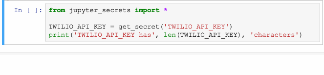
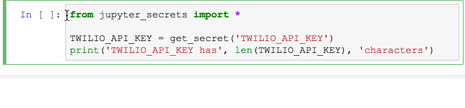

Jupyter Secrets
===============

|PyPI version| |Doc Status| |License| |Supported Python|

**Jupyter Secrets** provides functions for using secrets in a Jupyter notebook.

The first time `get_secret` is called, it prompts the user for the value.
After this value is read, it is saved in keypass, and the Jupyter output cell is
cleared.

|gif1|

Subsequent calls to `get_secret`, use the saved value. This is true even
if they are called in a different process running in the same account -- for
example, if the machine has been rebooted, or the local Jupyter server has
otherwise been shut down and restarted.

|gif2|

.. note:: This package won't work on Colaboratory_ (Colaboratory doesn't run
    `keyring`). It probably won't work on some other hosted notebook environments.

.. warning:: This package stores the secret on the Jupyter server. Don't trust
    it with secrets you don't trust the Jupyter server with. (This is true for
    all means of using a secret in a notebook.)

.. warning:: The package is intended to reduce the likelihood of accidental
    disclosure of secrets in notebook source. It won't secure a secret from code
    that is running *in* the notebook; and it won't keep you from writing code
    that displays the secret in a notebook output cell -- in which case it has
    been disclosed to whoever can see the notebook.

Usage
-----

.. code:: python

        from jupyter_secrets import *

        TWILIO_API_KEY = get_secret('TWILIO_API_KEY')

Alternatives
------------

Secrets can also be stored in an environment variable, and read from the
notebook. This is a best practice for applications (and especially web and other
`server-side services`_), but I've found it inconvenient for notebooks -- the
notebook server must be re-started to pick up a new environment variable; and,
it complicates the setup instructions for notebook users.

Development
-----------

Install dev tools:

.. code:: bash

    $ pip install -r requirements-dev.txt

Install locally:

.. code:: bash

    flit install --symlink

License
-------

MIT

.. |PyPI version| image:: https://img.shields.io/pypi/v/jupyter_secrets.svg
    :target: https://pypi.python.org/pypi/jupyter_secrets
    :alt: Latest PyPI Version
.. |Doc Status| image:: https://readthedocs.org/projects/jupyter_secrets/badge/?version=latest
    :target: http://jupyter_secrets.readthedocs.io/en/latest/?badge=latest
    :alt: Documentation Status
.. |License| image:: https://img.shields.io/pypi/l/jupyter_secrets.svg
    :target: https://pypi.python.org/pypi/jupyter_secrets
    :alt: License
.. |Supported Python| image:: https://img.shields.io/pypi/pyversions/jupyter_secrets.svg
    :target: https://pypi.python.org/pypi/jupyter_secrets
    :alt: Supported Python Versions

.. _API documentation: http://jupyter_secrets.readthedocs.io/en/latest/?badge=latest#module-jupyter_secrets

.. _Colaboratory: https://colab.research.google.com/
.. _Hydrogen: https://nteract.io/atom
.. _Nteract: https://nteract.io
.. _server-side services: https://12factor.net/